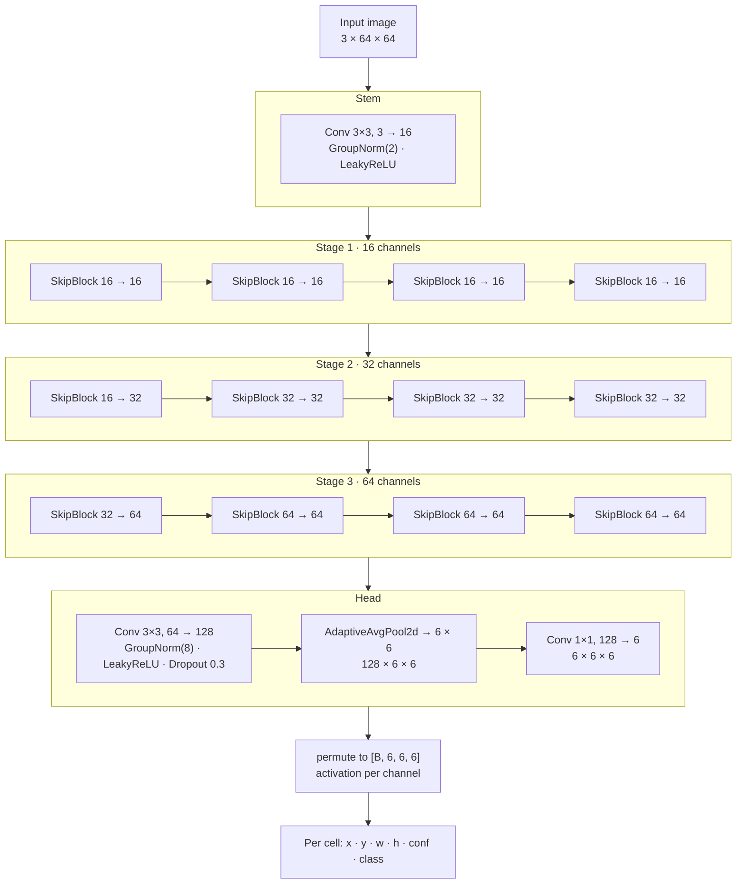
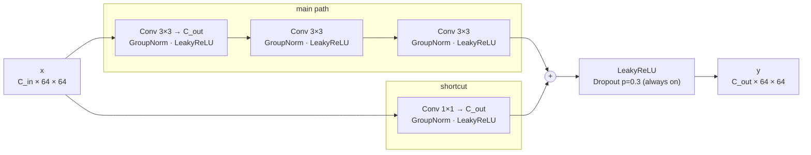
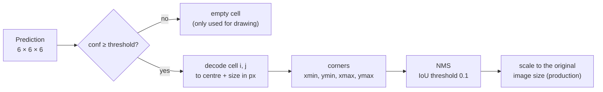
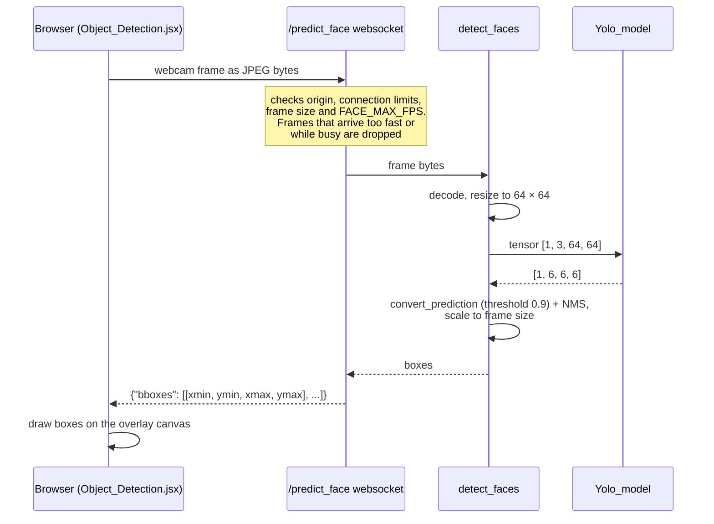

# YOLO face detector

A small single-shot face detector in the style of YOLO v1. It splits the image
into a 6 × 6 grid and predicts at most one face per grid cell. The website uses
it for live webcam face detection over a websocket.

| | |
|---|---|
| Model code | [`api/src/models/yolo.py`](../src/models/yolo.py) (`Yolo_model`, `SkipBlock`, `convert_prediction`) |
| Training code | [`api/src/yolo/`](../src/yolo/) (`config.py`, `dataset.py`, `loss.py`, `tasks.py`) |
| Deployed weights | `api/build_models/face_detection_yolo` (PyTorch `state_dict`) |
| Production use | [`api/src/production/inference.py`](../src/production/inference.py) `detect_faces`, websocket `/predict_face` |
| Input | RGB image resized to 64 × 64, values in [0, 1] |
| Output | 6 × 6 grid × 6 values per cell (x, y, w, h, confidence, class) |
| Classes | 1 (face) |
| Parameters | 657,254 (with `c_hidden=16`) |
| Speed | about 18 ms per image on CPU, batch size 1 (measured on the dev machine) |

## Architecture

The network is a fully convolutional stack of residual "skip blocks". It never
downsamples: every layer works at the full 64 × 64 resolution. At the end, one
`AdaptiveAvgPool2d` reduces the feature map to the 6 × 6 grid, and a 1 × 1
convolution turns each grid cell's features into a prediction.



Every layer up to and including the head's 3 × 3 conv keeps the spatial size at
64 × 64. Only the channel count changes.

| Index in `model` | Layer | Output shape (batch 1) | Parameters |
|---|---|---|---|
| 0–2 | Conv 3×3 + GroupNorm + LeakyReLU | 16 × 64 × 64 | 480 |
| 3–6 | 4 × SkipBlock 16 → 16 | 16 × 64 × 64 | 4 × 7,360 |
| 7–10 | SkipBlock 16 → 32, 3 × SkipBlock 32 → 32 | 32 × 64 × 64 | 23,936 + 3 × 29,056 |
| 11–14 | SkipBlock 32 → 64, 3 × SkipBlock 64 → 64 | 64 × 64 × 64 | 94,976 + 3 × 115,456 |
| 15–18 | Conv 3×3 + GroupNorm + LeakyReLU + Dropout | 128 × 64 × 64 | 74,112 |
| 19 | AdaptiveAvgPool2d(6, 6) | 128 × 6 × 6 | 0 |
| 20 | Conv 1×1 | 6 × 6 × 6 | 774 |

The channel counts scale with `c_hidden` (default 16): c, 2c, 4c, then 8c in the
head. The output has `boxes * 5 + labels` channels. With 1 box and 1 label
that is 6.

### SkipBlock

Each block is a residual unit. Three 3 × 3 convolutions form the main path and
a 1 × 1 convolution forms the shortcut. The 1 × 1 conv lets the shortcut change
the channel count.



All GroupNorm layers use `C / 8` groups, so each group holds 8 channels.

### Design notes

- **No downsampling.** All twelve blocks run at 64 × 64. This makes the network
  cheap in parameters but comparatively expensive in compute and memory for its
  size.
- **Receptive field.** The network has 38 stacked 3 × 3 convolutions (1 stem,
  36 in the blocks, 1 in the head). That gives a receptive field of
  1 + 38 × 2 = 77 px, so every output cell can see the whole 64 px image.
- **Uneven pooling bins.** 64 is not divisible by 6, so `AdaptiveAvgPool2d`
  averages bins of 10–11 px, and neighbouring bins overlap slightly.
- **Layer names are part of the file format.** `build_models/face_detection_yolo`
  is a plain `state_dict` keyed by names like `model.3.conv.0.weight`. Adding,
  removing or reordering layers in `Yolo_model` breaks loading of the deployed
  weights.

## Output encoding

`forward` returns a tensor of shape `[batch, 6, 6, 6]`. For each grid cell
`[i, j]` the last dimension holds:

| Channel | Meaning | Range | Activation |
|---|---|---|---|
| 0 | `x`: box centre inside the cell, as a fraction of the cell width | 0–1 | sigmoid |
| 1 | `y`: box centre inside the cell, as a fraction of the cell height | 0–1 | sigmoid |
| 2 | `w`: box width as a fraction of the image width | ≥ 0 | `exp` or sigmoid |
| 3 | `h`: box height as a fraction of the image height | ≥ 0 | `exp` or sigmoid |
| 4 | confidence that a face's centre lies in this cell | 0–1 | sigmoid |
| 5 | class score (face) | 0–1 | sigmoid |

`size_activation` decides how `w` and `h` are produced:

- `"exp"`: `w = exp(raw)`, unbounded. The **deployed** weights were trained
  this way, so production sets `FACE_SIZE_ACTIVATION = "exp"`.
- `"sigmoid"`: `w = sigmoid(raw)`, bounded to 0–1. This is the **training
  default** in `Config.size_activation`.

A model must always run with the activation it was trained with.

**Grid index convention.** The first grid index `i` is the horizontal cell
(column) and the second `j` is the vertical cell (row). The dataset builds
targets this way, and `convert_prediction` reads them back the same way.

The convolutional feature map is laid out `[row, column]`, so the network
effectively learns a spatial transpose. Its receptive field covers the whole
image, so it can do that. A check on the deployed model confirms it: on 69
validation images with one face in an off-diagonal cell, the most confident
cell matched the `[column, row]` target 49 times and the transposed cell once.
If you change the dataset or the decoding, keep both on the same convention.

## From prediction to boxes

`convert_prediction(label, image, threshold)` turns one `[6, 6, 6]` output into
pixel boxes. It also works on a target tensor, which is how `view-data` draws
the ground truth.



For a cell `[i, j]` on a 64 px image with a 6 × 6 grid (cell size
`c = 64 / 6 ≈ 10.67 px`):

```
centre_x = (i + x) · c          width  = w · 64
centre_y = (j + y) · c          height = h · 64

xmin = centre_x − width / 2     xmax = xmin + width     (width and height are at least 1 px)
ymin = centre_y − height / 2    ymax = ymin + height
```

Non-maximum suppression (`nms` in
[`api/src/common/boxes.py`](../src/common/boxes.py)) sorts the boxes by
confidence. It keeps the best box and drops every other box that overlaps it
with IoU ≥ 0.1. The low threshold suits faces, which rarely overlap.

In production, `detect_faces` multiplies the boxes by `W / 64` and `H / 64` to
map them back to the size of the uploaded frame.

## Training

### Data

- **Format.** COCO: images plus `_annotations.coco.json` in each folder.
  Defaults: `api/data/faces_scenery/train` and `api/data/faces_scenery/test`.
- **Resize.** Images are resized to 64 × 64.
- **Augmentation** (albumentations):
  - horizontal flip, p = 0.5
  - brightness/contrast, p = 0.2
  - affine: translate ±40 %, scale 0.5–1.5, edge pixels replicated, p = 0.5
  - boxes that keep less than 50 % of their area are dropped
- **Augmented validation.** `augment_val=True` by default, so the validation
  set is augmented too. The original code did this.
- **Targets.** `YoloDataset` builds a `[6, 6, 5 + classes]` target per image.
  - Each cell takes the largest face whose centre lies in it. Annotations are
    sorted by area, largest first, and each face is assigned only once.
  - `x` and `y` are the centre's offset inside the cell, divided by the cell
    size.
  - `w` and `h` are the box size divided by the image size.
  - Confidence is 1, and the class is one-hot.
  - All other cells are zero.

### Loss

`YoloLoss` ([`api/src/yolo/loss.py`](../src/yolo/loss.py)) is the sum of
four unweighted terms:

| Term | Cells | Function |
|---|---|---|
| box | cells with a face | MSE on (x, y, w, h) |
| object | cells with a face | MSE on confidence vs 1 |
| no-object | empty cells | MSE on confidence vs 0 |
| class | cells with a face | binary cross-entropy (with logits) |

Each term is averaged over its own set of cells. So the roughly 35 empty cells
together weigh the same as the one or two face cells, without the λ factors the
original YOLO paper uses.

### Running

The commands run from `api/`. Every `Config` field can be overridden on the
command line.

```bash
python -m src.main yolo.train                    # train (500 epochs, batch 64, Adam lr 1e-3, wd 1e-4)
python -m src.main yolo.train --epochs 50 --size-activation exp
python -m src.main yolo.view-data                # show validation images with their target grid
python -m src.main yolo.sample                   # show the trained model's predictions
python -m src.main yolo.webcam --camera 0        # live detection on a local webcam, q quits
python -m src.main yolo.benchmark-workers        # find the fastest DataLoader num_workers
python -m src.main yolo.train --help             # list every option
```

- **Checkpoints.** Training keeps the checkpoint with the lowest validation
  loss at `saved_models/face_detection_yolo/face_detection_yolo`.
- **Drawn grids.** `sample`, `view-data` and `webcam` draw red boxes for
  detections, blue for cells with a face, and green for empty cells.
- **Thresholds.** These tasks draw a box from confidence 0.95 (`--threshold`).
  Production uses 0.9.

### Deploying a new model

1. Train it; the result is in `api/saved_models/face_detection_yolo/`.
2. Copy that file to `api/build_models/face_detection_yolo`.
3. Make the settings in
   [`api/src/production/settings.py`](../src/production/settings.py) match
   how it was trained:
   - `FACE_SIZE_ACTIVATION`: `"sigmoid"` if you kept the training default.
   - `FACE_C_HIDDEN`, `FACE_GRID` and `FACE_IMAGE_SIZE`.
4. Restart the API. A size mismatch fails at startup in `load_checkpoint`.
   An activation mismatch does not fail; it silently produces wrong box sizes.

## Use in production



Relevant settings in `api/src/production/settings.py`:

| Setting | Value | Meaning |
|---|---|---|
| `FACE_MODEL_FILE` | `face_detection_yolo` | file in `api/build_models/` |
| `FACE_IMAGE_SIZE` | 64 | model input size |
| `FACE_GRID` | 6 | grid size |
| `FACE_C_HIDDEN` | 16 | base channel count |
| `FACE_SIZE_ACTIVATION` | `"exp"` | must match the weights |
| `FACE_THRESHOLD` | 0.9 | minimum confidence for a box |
| `FACE_MAX_FPS` | 5.5 (env) | frames per second processed per websocket |

## Known quirks and limitations

- **Dropout is always on.** `SkipBlock.forward` calls `F.dropout(..., p=0.3)`,
  which defaults to `training=True`, so it stays active in `eval()` mode.
  - Two runs on the same image give slightly different outputs, and boxes can
    flicker between video frames.
  - The deployed weights were trained this way, so it is left as is.
  - The head's `nn.Dropout` behaves normally and is off in eval mode.
- **Activation default differs from the deployed model.** Training defaults to
  `"sigmoid"`, while the deployed weights need `"exp"`. See
  [Deploying a new model](#deploying-a-new-model).
- **Class loss applies a sigmoid twice.** The model already outputs sigmoid
  values, and `binary_cross_entropy_with_logits` applies another sigmoid. The
  class output is unused with a single class (`convert_prediction` ignores it),
  so this does not affect detections.
- **One face per cell, at most 36 faces.** When two face centres fall into the
  same cell, only the larger one is a training target, and the model can
  predict only one box there.
- **No anchors, one box per cell.** `boxes > 1` is accepted by the constructor,
  but the dataset, loss and `convert_prediction` only handle the first box.
- **Small input.** At 64 × 64, faces that are a few pixels tall after resizing
  are hard to detect. Very wide or tall frames are squashed, because the
  resize does not keep the aspect ratio.
- **Noisy validation loss.** The validation set is augmented by default, so the
  loss that picks the best checkpoint changes from epoch to epoch even with
  fixed weights.
